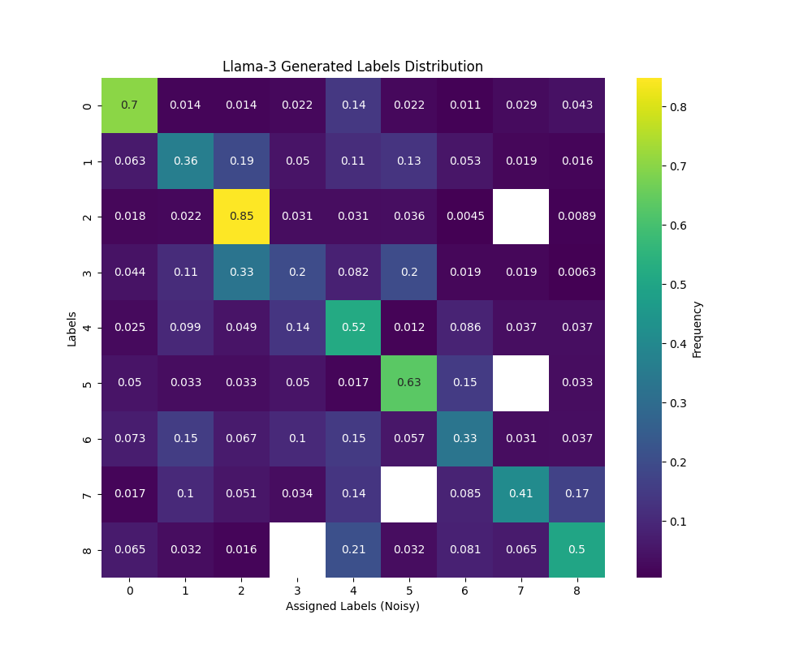
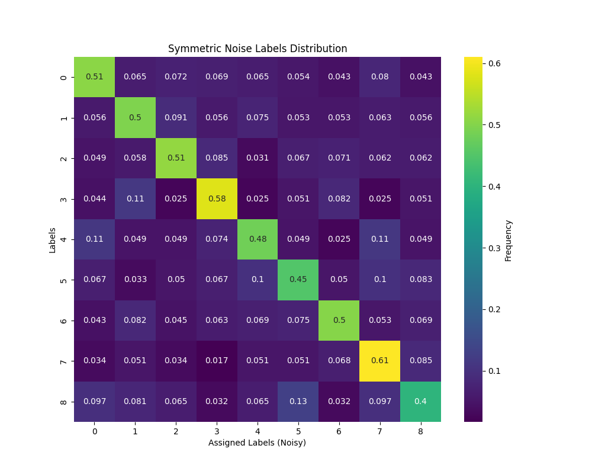
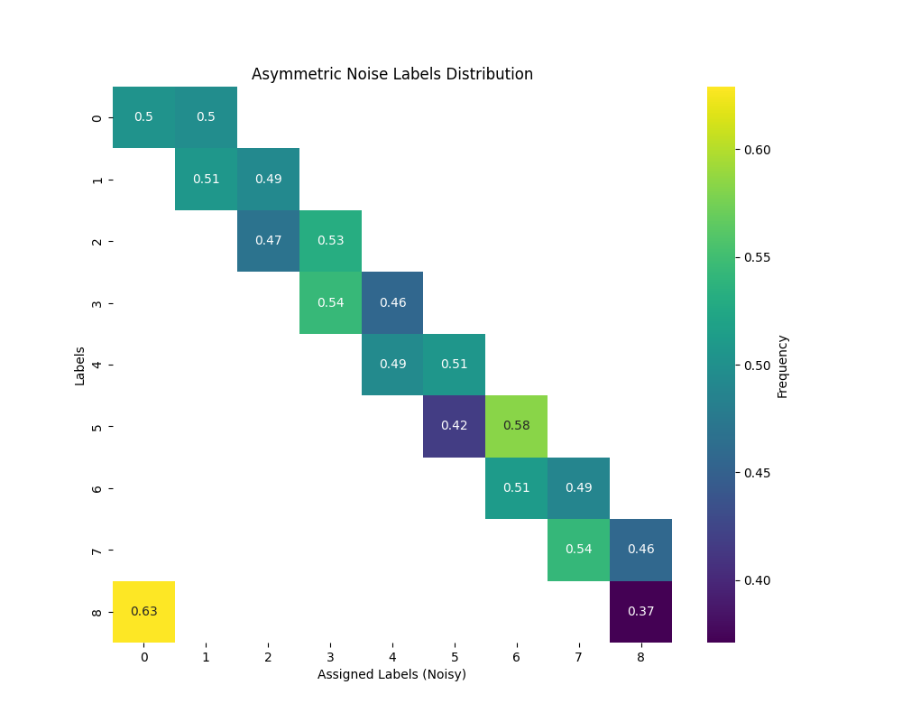
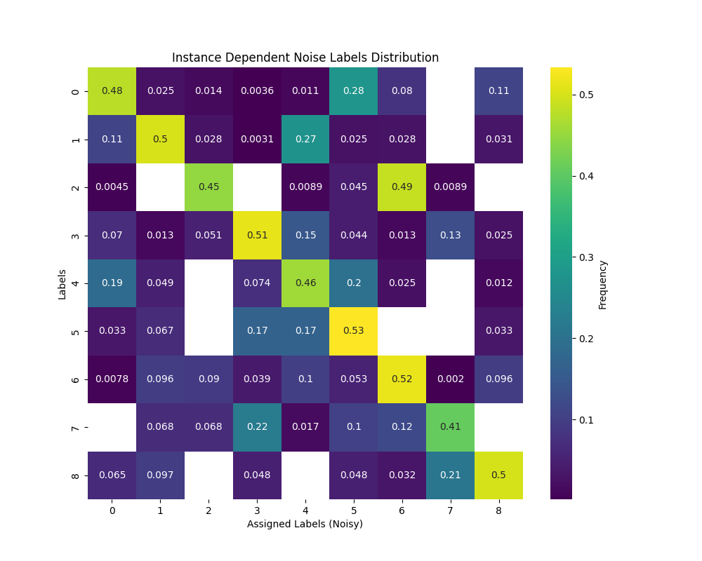
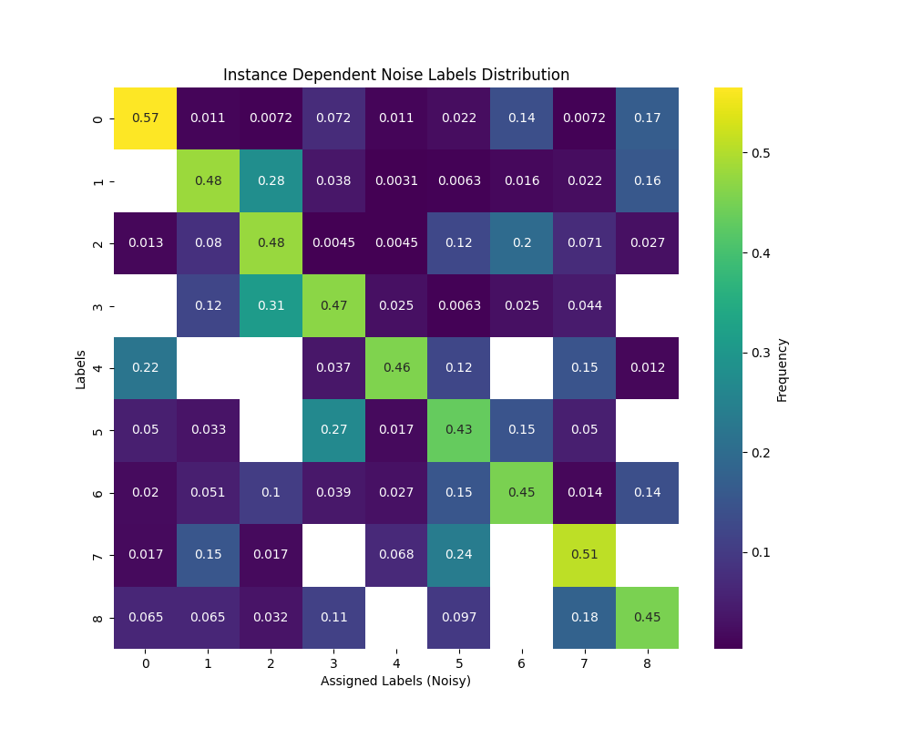
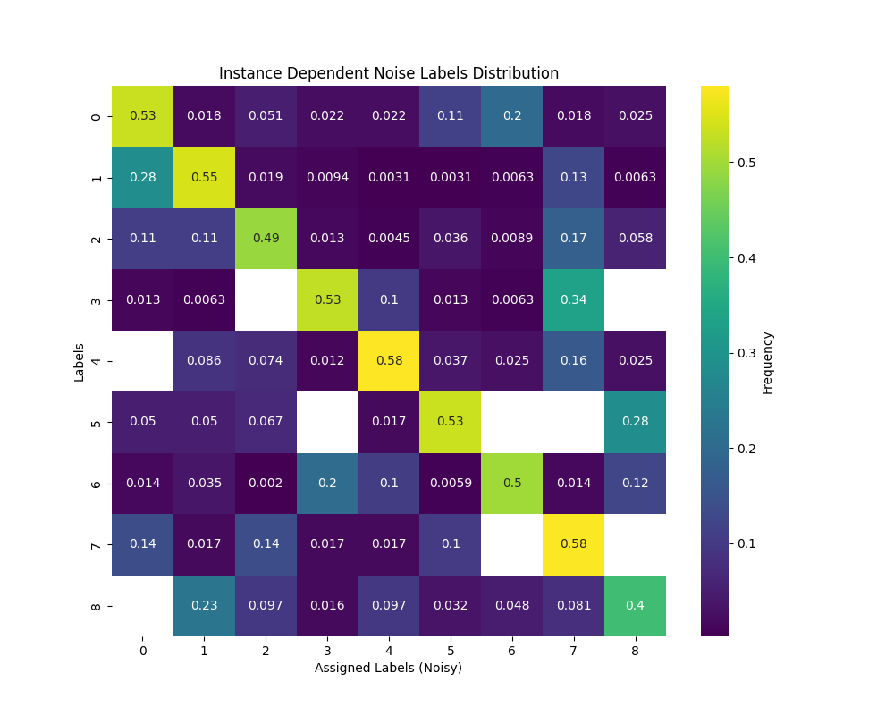
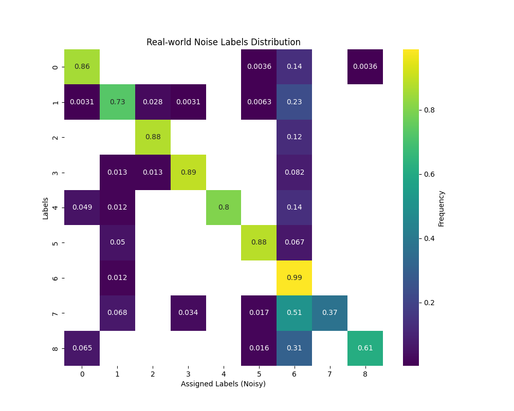

LLMs Noise
<figure>
    
    <figcaption>Figure1: Llama-3 generated Label distribution</figcaption>
</figure>

Synthetic Noise of 50%

<figure>
    
    <figcaption>Figure2: Symmetric noise Label distribution</figcaption>
</figure>

<figure>
    
    <figcaption>Figure2: Asymmetric noise Label distribution</figcaption>
</figure>

<figure>
    
    <figcaption>Figure3: Instance dependent noise Label distribution under seed 0</figcaption>
</figure>

<figure>
    
    <figcaption>Figure4: Instance dependent noise Label distribution under seed 10</figcaption>
</figure>

<figure>
    
    <figcaption>Figure5: Instance dependent noise Label distribution under seed 15</figcaption>
</figure>

Real World Noise of 16%
<figure>
    
    <figcaption>Figure6: Real-world noise Label distribution</figcaption>
</figure>